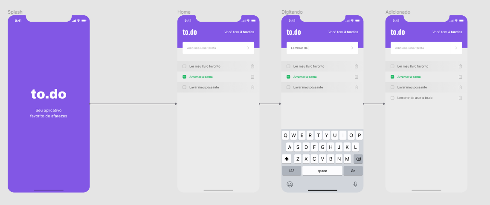
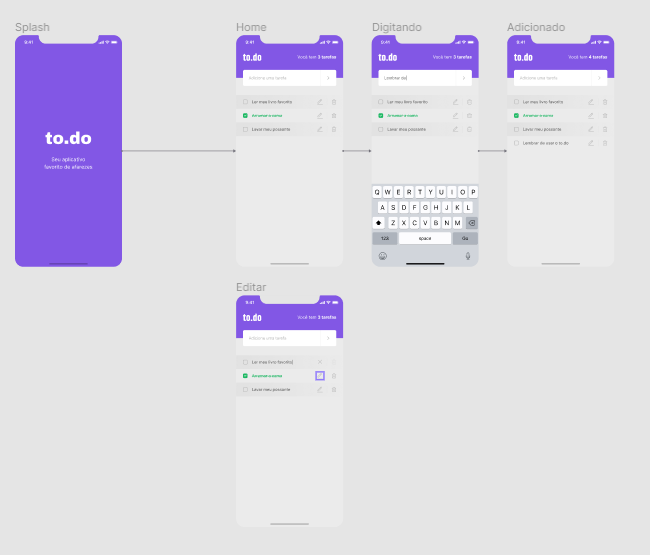

<br>
<div align="center">
 
  <h4 align="left">
    🚀  Desafio 01 - Conceitos do React Native
  </h4> 
  
##  💻 As funcionalidades do aplicativo são:

- Contagem de tarefas;
- Adicionar uma nova tarefa;
- Remover uma tarefa;
- Marcar e desmarcar uma tarefa como concluída.


   

</div>

---

<br>
<div align="center">
 
  <h4 align="left">
    🚀  Desafio 02 - Adicionando edição e alertas
  </h4> 
  
##  💻 Sobre o desafio:

- Edição de uma tarefa;
- Exibir alerta pedindo confirmação ao remover uma tarefa;
- Exibir alerta ao tentar adicionar tarefa com o mesmo nome.

 
   
  
</div>

---

<video src="./src/assets/video/Peek_2021-07-06_14-37.mp4"></video>

```bash
# Clone o projeto
$ git clone https://github.com/lucianopedesol/ignite-react-native-todos.git

# Acesse o repositório
$ cd ignite-react-native-todos

# Instale as dependencias
$ npm install  

# Execute a aplicação
$ npx react-native run-android
 
```